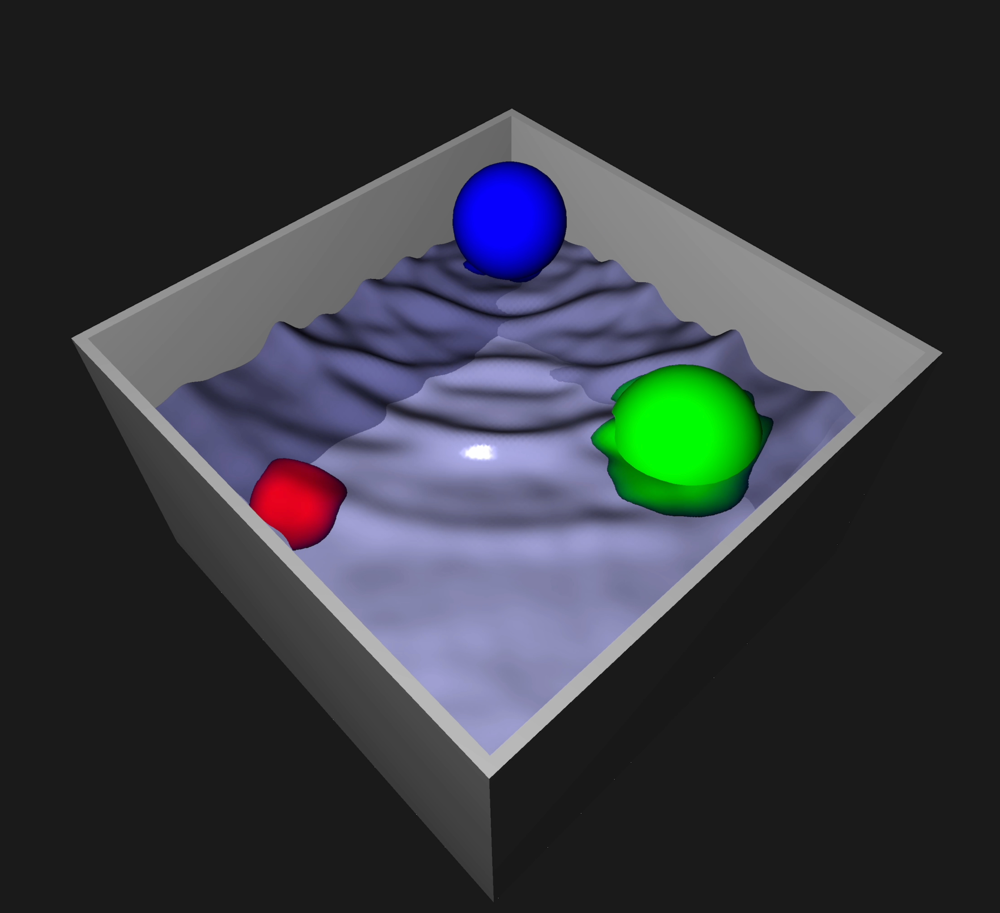

# JAX OpenGL Height-Field Water Simulator

[](https://youtu.be/Vrl7CklleO4?si=gBdu8EDwAdmfNjJm)

This is a simple height-field water simulator written in Python using `JAX` and `OpenGL`. It is based on the awesome work of [Matthias](https://www.youtube.com/watch?v=hswBi5wcqAA) which was implemented using `three.js`.

The main differences:
* Python
* Uses JAX so simulator code can run on CPU, GPU, METAL and TPU (TPU untested)
* Uses pure OpenGL with no external libraries

This application has been tested with Python 3.10 on CPU and METAL GPU on MacOS. It should work on any platform that supports `JAX` and `OpenGL`. On my MacBook Pro (M1) it runs at 350fps with 101x101 grid when using JAX CPU.
On a Linux x86_64 machine with a NVIDIA 1080, I was also able to achieve ~350fps with 101x101 grid when using JAX CUDA. Tested with an NVIDIA 4090 and Ryzen 7950X3D, I achieved ~770 FPS with GPU and ~363 FPS with CPU-only.

## Run Instructions
First make sure you have Python. You may want to change how you install JAX so that you can run on CPU, GPU or METAL GPU. By default I have assumed you want to run the simulator code CPU which is easiest and fastest.
```
pip install git+https://github.com/cemlyn007/water-simulator "jax[cpu]"
water-simulator --n 101
```

## Ubuntu
To install this to run, I found that I needed the following packages from `apt`:
```
apt install python3-dev gcc g++
```
